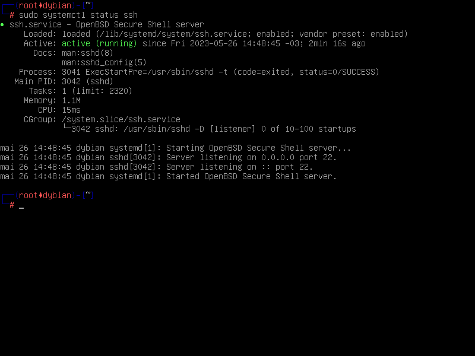
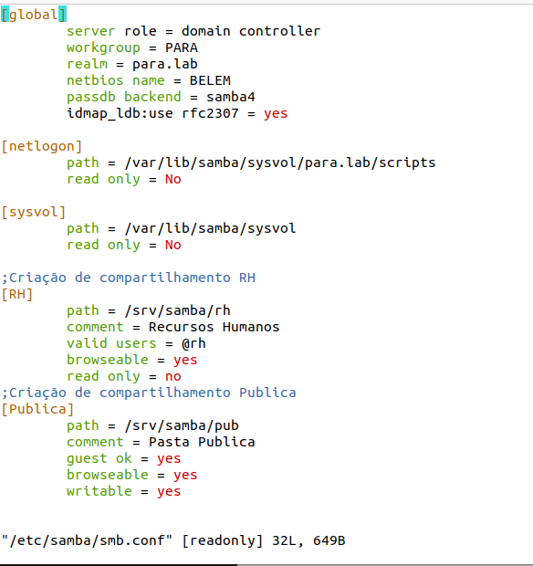
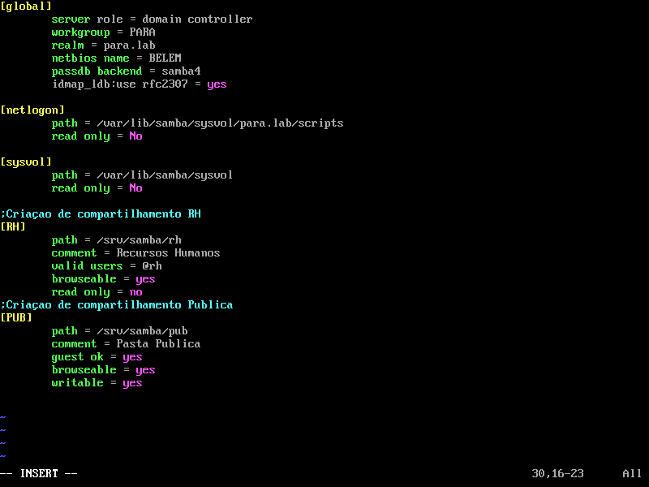
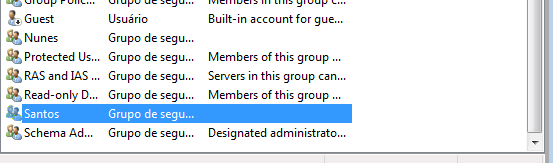
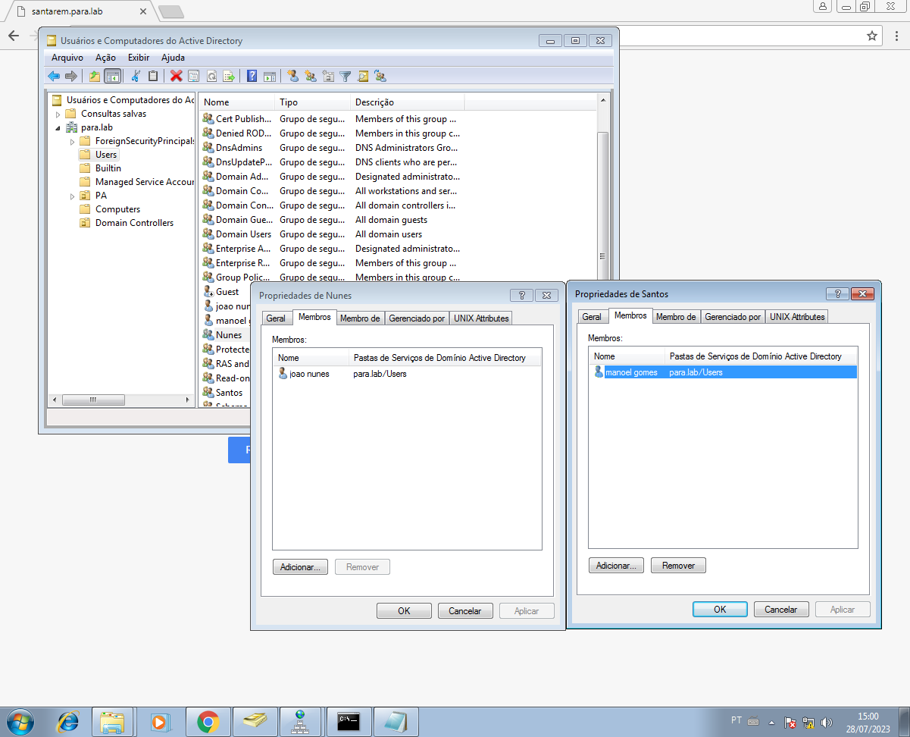

# SSH

- Instalar servidor SSH: `sudo apt install openssh-server`

## Tranferir pastas

- Para tranferir uma pasta da Oulu para a VM, foi utilizado o comando scp r- USUARIO@SERVIDOR: CAMINHO-DA-PASTA/ DESTINO/

- Para tranferir da VM para Oulu, scp -r PASTAORIGEM USUARIO@SERVIDOR:PASTADESTINO

## Acesso remoto SSH

- Conexão com senha:

    

    

- Configurar conexão sem senha:

    - `ssh keygen -t ed25519` para criar um par de chaves SSH

    - `ssh-copy-id -i ~/.ssh/id_ed25519.pub USUARIO@HOST` para copiar a chave pública ssh

    - agora basta usar `ssh USUARIO@HOST`

# Interface de Rede

1. Comando para descobrir interface de rede: - `ip -br -c link` ou `ip a`

2. Verificar endereços IPV4 delas: ip -br -c 4 address

3. Desativar uma interface: `ip link set INTERFACE down`

4. Ativar uma interface: `ip link set INTERFACE down`

// lshw : listagem de hardware

## Configuração no Debian

 - Sistema ifupdown
 - Arquivo de configuração:
    - `/etc/network/interfaces`
    - `/etc/network/interfaces.d/*`

        
        
    - `/etc/resolv.config` (para checar o DNS, as vezes)
 - comando para desativar : `ifdown INTERFACE`
 - comando para desativar : `ifup INTERFACE`

 ## Configuração com `systemd-networkd`

 - sistema: `systemd-networkd`
 - arquivo de configuração : `/etc/systemd/network/*.network`
 - comandos para ativar as novas configurações:
    - `systemctl reload system-networkd.service`

# DNS

- 5 Registros de Recurso do tipo A(Hosts)

# Samba4

Instalação samba4 no Alpine

- `sudo apk add samba samba-common-tools`

## Configuração

- Arquivo smb.conf `sudo nano /etc/samba/smb.conf`

    

- habilitando Samba `sudo rc-update add samba`

# Compartilhamento de Pastas

## Compartilhamento com samba

- Compartilhamento de pasta usando o samba

    1. acessar o arquivo de configuração do samba `sudo nano /etc/samba/smb.conf`

    2. Na seção [global], localize: `workgroup = NOME_DO_GRUPO_DE_REDE` Substitua "NOME_DO_GRUPO_DE_REDE" pelo nome do grupo de trabalho que você deseja utilizar.

    3. Adicione uma seção para o compartilhamento da pasta que dejesa criar e suas informações pertinentes:

        

    4. salve o arquivo e reinicie o serviço usando `sudo service smbd restart`
        - `samba-tool testparm` para testar a sintaxe do arquivo

    5. pastas compartilhadas

    

### Caminho UNC (Universal Naming Convention)

- `\\nome_do_servidor\nome_do_compartilhamento\caminho\para\o\recurso`

# Grupos
Criação de grupos:

Usuários adicionados aos Grupos:
